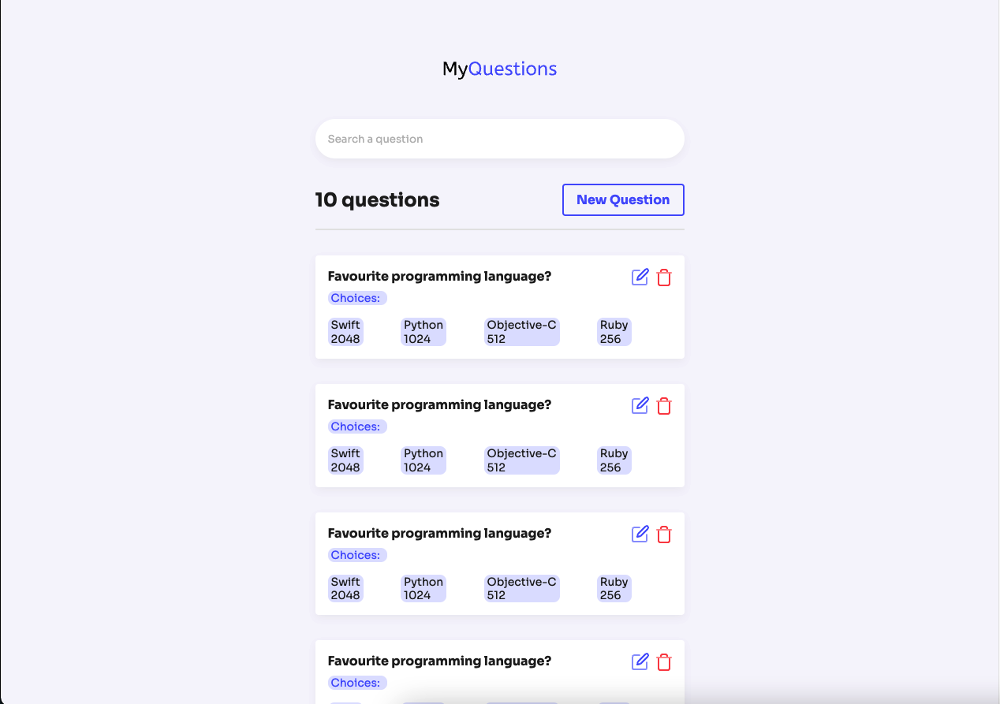

# 

A React Application which allows users to vote on questions, see how many people voted for each option, create new questions and share with their friends.

## How to run application?

Install dependencies and run the app:

| Command          | Description                                            |
| ---------------- | ------------------------------------------------------ |
| `yarn`           | Install dependencies                                   |
| `yarn start`     | Run the app locally                                    |

This is just a subset of what's in the `package.json` file.

### Technologies

- **JavaScript** main language
- **React** for our UI framework
- **Styled Components** for css-in-js
- **ESLint** for enforcing code quality standards
- **Vercel** for deployment

## Technical design

This is essentially a single-page app, with the main page located at `src/pages/QuestionListScreen/index.js`. That page renders `Question List Screen`, which renders the page with all questions. 

Happy coding!
